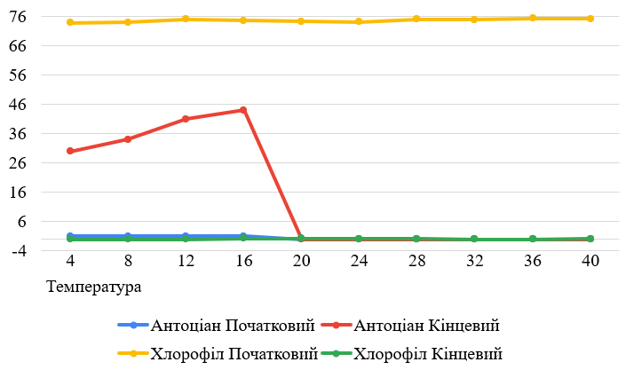

## Комп'ютерні системи імітаційного моделювання

## СПм-22-4, **Коломоєць Борис**

### Лабораторна робота №**1**. Опис імітаційних моделей та проведення обчислювальних експериментів

### Варіант 11, модель у середовищі NetLogo:

[Autumn](https://www.netlogoweb.org/launch#http://www.netlogoweb.org/assets/modelslib/Sample%20Models/Biology/Autumn.nlogo)

### Вербальний опис моделі:

Ця модель імітує процес зміни кольорів і відпадання листя на деревах під час осіннього періоду. У середовищі, де клімат теплий влітку та холодний взимку, листя дерев
змінює свої кольори перед опаданням. Модель дозволяє досліджувати та розуміти щорічні події, а також вивчати вплив різних факторів на цей процес, таких як температура,
тривалість дня та інші внутрішні та зовнішні чинники.

### Керуючі параметри:

- **number-of-leaves** - цей параметр вказує, скільки листів буде присутньо в середовищі під час запуску симуляції. Змінюючи значення "number-of-leaves" за допомогою
  відповідного слайдера, маємо змогу впливати на кількість листів, які будуть проходити етапи під час виконання симуляції.
- **start-sugar-mean** - цей параметр вказує, яке середнє значення для змісту цукру серед листя.
- **start-sugar-stddev** - цей параметр вказує, розподіл початкового розподілу цукру серед листя.
- **temperature** - цей параметр вказує, на температуру навколишнього середовища.
- **rain-intensity** - цей параметр вказує, на інтенсивність дощу.
- **wind-factor** - цей параметр вказує, на силу вітру навколишнього середовища.
- **sun-intensity** - цей параметр вказує, на інтенсивність впливу сонця.

### Внутрішні параметри:

- **water-level** - відображає кількість води в листі.
- **sugar-level** - показує кількість цукру в листі.
- **attachedness** - визначає, наскільки тісно лист прикріплений до дерева.
- **chlorophyll** - відображає рівень хімічних речовин, що забарвлюють листя в зелений колір.
- **carotene** - визначає рівень хімічних речовин, які надають листю жовтий колір.
- **anthocyanin** - показує рівень хімічних речовин, які забарвлюють листя в червоний колір.
- **location** - показує місце знаходження капель дощу, може бути "падає", "у коренях", "у стовбурі" чи "у листі".
- **amount-of-water** - показує кількість води.
- **bottom-line** - визначає, де знаходиться поверхня землі.
- **evaporation-temp** - температура, при якій вода випаровується.

### Показники роботи системи:

- **Leaves**: графік відображення двох показників живих листів та мертвих листів (які впали на землю).
- **Weather conditions**: графік відображення погодних умов таких як: дощ, сонце, температура, вітер.
- **Leaf averages**: графік відображення середніх значень змісту таких складників таких як: хлорофіл, вода, цукор, каротин, антоціан, приєднання (міцність з якою
  тримається лист).

### Примітки:

- Коли інтенсивність сонця середня та температура навколишнього середовища близька до 0, листя тримаються на дереві набагато довший час, через те, що сонце грає важливу
  роль
  в цьому процесі
- При відсутності вітру маленька доля листя залишаться на дереві дуже довгий час
- Даний проєкт є гарним прикладом того що листопад залежить від багатьох факторів: цукор в складі листя, вітер, сонце, дощ.

### Недоліки моделі:

- При відсутності вітру листя не падають майже ніколи.
- Дощ не впливає на час через який листя впадуть, в реальному житті від капель які бʼють по листя цей процес існує.
- При максимальному дощі не з'являються калюжи.
- Листя стають жовтим рівномірно, не спочатку зовнішні, які захищають внутрішні від природного впливу, а рівномірно

## Обчислювальні експерименти

### 1. Вплив температури на показники Антоціану та Хлорофіл в змісті листя

Досліджується залежність впливу температури на зміст листя через 50 тактів.
Експерименти проводяться при 4-40 °C, з кроком 4, усього 10 симуляцій.  
Інші керуючі параметри мають значення за замовчуванням:

- **number-of-leaves**: 500
- **start-sugar-mean**: 50
- **start-sugar-stddev**: 25
- **rain-intensity**: 15
- **wind-factor**: 5
- **sun-intensity**: 80

<table>
<thead>
<tr><th>Температура</th><th>Хлорофіл Початковий</th><th>Хлорофіл Кінцевий</th><th>Антоціан Початковий</th><th>Антоціан Кінцевий</th></tr>
</thead>
<tbody>
<tr><td>4</td><td>73.8</td><td>0</td><td>1</td><td>30</td></tr>
<tr><td>8</td><td>74</td><td>0</td><td>1</td><td>34</td></tr>
<tr><td>12</td><td>75</td><td>0</td><td>1.1</td><td>41</td></tr>
<tr><td>16</td><td>74.6</td><td>0.3</td><td>1</td><td>44</td></tr>
<tr><td>20</td><td>74.2</td><td>0.3</td><td>0</td><td>0</td></tr>
<tr><td>24</td><td>74.1</td><td>0.2</td><td>0</td><td>0</td></tr>
<tr><td>28</td><td>75</td><td>0.1</td><td>0</td><td>0</td></tr>
<tr><td>32</td><td>74.9</td><td>0.03</td><td>0</td><td>0</td></tr>
<tr><td>36</td><td>75.3</td><td>0</td><td>0</td><td>0</td></tr>
<tr><td>40</td><td>75.1</td><td>0.2</td><td>0</td><td>0</td></tr>
</tbody>
</table>

Висновки експерименту:

- Зі збільшенням температури частина хлорофілу постійно зростала поступово, але кінцеві значення мали маленьку різницю та зростали також в залежності від температури
- [4-16] °C - значення як початкового, так і кінцевого хлорофілу поступово зростає
- Після певної межі у 20°C значення відсутні як на початку, так і наприкінці симуляції

### 2. Вплив кількості овець на ефективність випасання

Досліджується залежність кількості овець на ефективність випасання пастухами через 500 тактів.
Експерименти проводяться при 50-500 овець, з кроком 50, усього 10 симуляцій.  
Інші керуючі параметри мають значення за замовчуванням:

- **num-shepherds**: 30
- **sheep-speed**: 0.02

<table>
<thead>
<tr><th>Кількість овець</th><th>Початкова ефективність</th><th>Кінцева ефективність</th></tr>
</thead>
<tbody>
<tr><td>50</td><td>87</td><td>89</td></tr>
<tr><td>100</td><td>75</td><td>86</td></tr>
<tr><td>150</td><td>67</td><td>77</td></tr>
<tr><td>200</td><td>57</td><td>71</td></tr>
<tr><td>250</td><td>52</td><td>66</td></tr>
<tr><td>300</td><td>45</td><td>61</td></tr>
<tr><td>350</td><td>38</td><td>56</td></tr>
<tr><td>400</td><td>33</td><td>52</td></tr>
<tr><td>450</td><td>27</td><td>49</td></tr>
<tr><td>500</td><td>26</td><td>46</td></tr>
</tbody>
</table>

Висновки експеременту:

- Більша кількість овець призводить до більшої розкиданості і розпорошеності стада, що робить випасання менш ефективним.
- Пастухам потрібно більше зусиль та часу, щоб згуртувати та керувати більшим стадом, що впливає на ефективність.
- Чим більше стає овець, тим швидше росте ефективність випасання. Але, загалом, це не суттєво.

### 3. Вплив швидкості овець на ефективність випасання

Досліджується залежність швидкості овець на ефективність випасання пастухами через 500 тактів.
Експерименти проводяться при 0.02 - 0.2 швидкості овець відносно пастухів, з кроком 0.02, усього 10 симуляцій.  
Інші керуючі параметри мають значення за замовчуванням:

- **num-shepherds**: 30
- **num-sheep**: 150

<table>
<thead>
<tr><th>Кількість овець</th><th>Початкова ефективність</th><th>Кінцева ефективність</th></tr>
</thead>
<tbody>
<tr><td>0.02</td><td>67</td><td>79</td></tr>
<tr><td>0.04</td><td>67</td><td>74</td></tr>
<tr><td>0.06</td><td>67</td><td>72</td></tr>
<tr><td>0.08</td><td>67</td><td>72</td></tr>
<tr><td>0.10</td><td>67</td><td>70</td></tr>
<tr><td>0.12</td><td>67</td><td>72</td></tr>
<tr><td>0.14</td><td>67</td><td>67</td></tr>
<tr><td>0.16</td><td>67</td><td>68</td></tr>
<tr><td>0.18</td><td>67</td><td>67</td></tr>
<tr><td>0.20</td><td>67</td><td>68</td></tr>
</tbody>
</table>

Висновки експеременту:

- Збільшена швидкість овець призводить до більшої розкиданості та розпорошеності стада, що робить випасання менш ефективним.
- Пастухам потрібно більше зусиль та часу, щоб згуртувати та керувати швидкими овцями, що доволі очевидно.
- При високій швидкості овець, пастухи мають більше труднощів у групуванні вівців і веденні їх до одного стада, що призводить до зменшення ефективності. При значеннях
  швидкості більше 0.12 стадо с